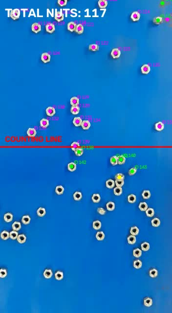
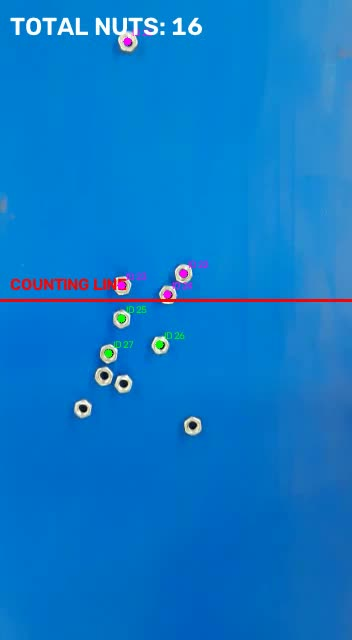
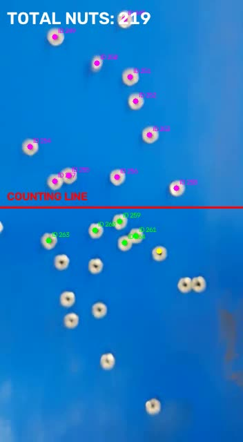

# Nut Detection, Tracking & Counting System

A classical computer vision system for detecting, separating, tracking, and counting metallic nuts moving on a conveyor belt.

The project was developed using **Python** and **OpenCV** without relying on deep learning object detectors. It combines image segmentation, Watershed-based object separation, motion-aware tracking, Hungarian assignment, and line-crossing logic to build a complete video-processing pipeline.

---

## Project Overview

The objective of this project is to automatically count metallic nuts moving on a conveyor from video.

The main challenge is not only detecting the nuts, but also handling cases where multiple nuts touch or overlap visually. A simple contour-based approach can merge nearby objects into a single detection, resulting in incorrect counting.

To address this, the system uses a multi-stage classical computer vision pipeline that separates touching objects before tracking them across frames.

---

## Processing Pipeline

The system processes each video frame through the following stages:

1. Frame preprocessing
2. HSV color segmentation
3. Morphological noise removal
4. Hole filling
5. Distance Transform
6. Local peak detection
7. Watershed segmentation
8. Object centroid extraction
9. Motion-aware object tracking
10. Hungarian one-to-one assignment
11. Line-crossing detection
12. Unique object counting

This pipeline allows the system to detect individual nuts, maintain their identities across consecutive frames, and count each object only when it crosses the defined counting line.

---

## Detection & Segmentation

### HSV Segmentation

The conveyor and metallic nuts have different visual characteristics, allowing the objects to be isolated using HSV-based thresholding.

HSV color space provides practical control over color-based segmentation compared with directly thresholding RGB values.

### Morphological Processing

Morphological operations are applied to reduce small segmentation noise and improve the object masks before further processing.

### Hole Filling

Because nuts naturally contain a central hole, the binary mask may represent one physical nut as a ring-shaped region.

Hole filling is applied before distance-based segmentation to produce a more stable representation of each object.

---

## Separating Touching Nuts

One of the main challenges in the project occurs when two or more nuts are touching.

Using only connected components or contours may incorrectly interpret touching nuts as a single object.

To solve this problem, the system combines:

- Distance Transform
- Local peak detection
- Marker generation
- Watershed segmentation

The Distance Transform estimates the distance of each foreground pixel from the nearest background region.

Local maxima are then used as markers representing likely individual object centers.

These markers are passed to the **Watershed algorithm**, which separates connected groups into individual nut detections.

---

## Object Tracking

After detecting the nuts in each frame, the system tracks them across the video.

Instead of matching detections using only the nearest current position, the tracker uses previous motion information to estimate the expected next position of each object.

A cost matrix is generated between predicted track positions and current detections.

The **Hungarian assignment algorithm** is then used to obtain a one-to-one matching between existing tracks and new detections.

This reduces incorrect associations and provides more stable tracking when multiple objects are moving close to each other.

---

## Counting Logic

A virtual counting line is defined across the conveyor.

Each tracked nut is counted only when its trajectory crosses this line in the expected direction.

The tracking IDs help prevent the same nut from being counted multiple times while it remains visible in the video.

---

## Engineering Iteration

During validation, the initial counting logic assumed the wrong conveyor movement direction.

After inspecting the tracking behavior and video sequence, the actual motion direction was identified and the line-crossing condition was corrected.

The final crossing condition checks for movement from below the counting line to above it:

```python
old_y > LINE_Y and new_y <= LINE_Y
```

This correction reflects an important part of the project development process: validating implementation assumptions against the actual video behavior.

---

## Project Results

The final pipeline successfully performs:

- Nut detection
- Separation of touching nuts
- Multi-object tracking
- Line-crossing detection
- Unique object counting

### Multiple Object Tracking



### Line Crossing and Counting



### Final Count



The final system output for the validation video was:

## **219 nuts**

This number represents the output of the implemented counting pipeline.

A manually verified ground-truth count would still be required before reporting a formal accuracy percentage.

---

## Validation Video

The repository includes the processed validation video showing the detection, tracking, and counting pipeline in operation.

**Validation Video:**  
[`videos/nut_counting_validation.mp4`](videos/nut_counting_validation.mp4)

---

## Jupyter Notebook

The complete project implementation is available in the included Jupyter Notebook.

**Notebook:**  
[`notebook/Nut_Counting_Project_FINAL.ipynb`](notebook/Nut_Counting_Project_FINAL.ipynb)

The notebook contains the full image-processing pipeline, detection logic, tracking system, Hungarian assignment, counting logic, and validation process.

---

## Technologies & Methods

- Python
- OpenCV
- NumPy
- SciPy
- Matplotlib
- Jupyter Notebook
- Classical Computer Vision
- HSV Color Segmentation
- Morphological Image Processing
- Distance Transform
- Watershed Segmentation
- Motion Prediction
- Hungarian Assignment Algorithm
- Object Tracking
- Line-Crossing Counting

---

## Key Challenges & Solutions

| Challenge | Solution |
|---|---|
| Separating metallic nuts from the conveyor | HSV-based segmentation |
| Small segmentation noise | Morphological processing |
| Holes inside the nuts | Hole filling |
| Touching nuts detected as one object | Distance Transform + Watershed |
| Maintaining object identity | Motion-aware tracking |
| Matching multiple tracks and detections | Hungarian assignment |
| Preventing duplicate counts | Track IDs + line-crossing logic |
| Incorrect initial motion assumption | Validation and crossing-direction correction |

---

## Repository Structure

```text
nut-detection-tracking-counting/
│
├── assets/
│   ├── nut_final_count_219.jpg
│   ├── nut_tracking_line_crossing.jpg
│   └── nut_tracking_multiple_objects.jpg
│
├── notebook/
│   └── Nut_Counting_Project_FINAL.ipynb
│
├── videos/
│   └── nut_counting_validation.mp4
│
├── .gitignore
├── README.md
└── requirements.txt
```

---

## Installation

Clone the repository:

```bash
git clone https://github.com/zyadkhalafamen/nut-detection-tracking-counting.git
```

Navigate to the project directory:

```bash
cd nut-detection-tracking-counting
```

Install the required Python packages:

```bash
pip install -r requirements.txt
```

Then open the notebook:

```bash
jupyter notebook
```

---

## Project Scope

This project demonstrates the implementation of an end-to-end **classical computer vision pipeline** for an industrial conveyor application.

It focuses on practical engineering challenges including object segmentation, separation of touching objects, temporal tracking, data association, counting logic, and iterative validation without relying on a pretrained deep learning object detector.
